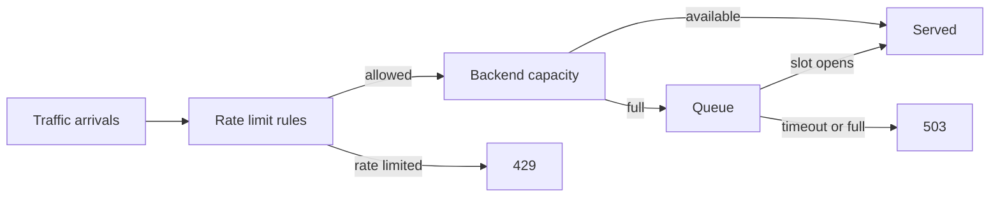

# Rate Limiter Simulator

Browser simulator for traffic, sliding-window rate limits, queue pressure, backend latency, `429`, and `503` outcomes.

Demo: https://ratelimiter-simulator.amir-rassafi.workers.dev/

## Design



## MCP

This repo now includes a small MCP server so an agent can reason about behavior instead of guessing from code or UI state.

### Why it exists

The MCP is meant for design review and coding support:
- run the simulator with explicit parameters
- compare two configurations
- normalize a component path like `WAF -> API gateway -> app -> DB` into the simulator's assumptions
- surface warnings when the limiter is looser than downstream capacity or timeouts look unrealistic

### How component alignment works

The current simulator is still a compact model, so the MCP collapses infrastructure components into three groups:
- control path: `client`, `internet`, `edge`, `waf`, `load_balancer`, `api_gateway`
- app stage: `app`, `app_service`, `service`
- dependency stage: `db`, `cache`, `queue`, `worker`, `third_party_api`, `dependency`

That means the agent does not simulate every box literally. It makes explicit assumptions:
- control-path components add fast decision latency and may attach limiter windows
- the app stage owns active capacity, pending capacity, and app timeout
- dependency components are folded into downstream latency, capacity, pending capacity, and dependency timeout

The MCP returns those assumptions so the agent can review them instead of hiding them.

### Tools

- `default_simulation_config`
- `simulate_scenario`
- `compare_scenarios`
- `review_component_path`

### Simple interface

The simplest interface for an agent is `review_component_path`.

The repo includes a complete newline-delimited JSON-RPC sample at:

```bash
examples/mcp-review-component-path.ndjson
```

Example input:

```json
{
  "traffic": { "rps": 120, "burstiness": 0.2 },
  "components": [
    {
      "kind": "waf",
      "name": "WAF",
      "latencyMs": 3,
      "jitterMs": 1,
      "rateLimiter": {
        "type": "sliding",
        "windows": [{ "windowMs": 1000, "limit": 40 }]
      }
    },
    { "kind": "api_gateway", "name": "Gateway", "latencyMs": 5, "jitterMs": 2 },
    { "kind": "app", "name": "App", "latencyMs": 80, "jitterMs": 10, "maxConcurrent": 20, "queueCapacity": 200, "timeoutMs": 1000 },
    { "kind": "db", "name": "DB", "latencyMs": 240, "jitterMs": 30, "maxConcurrent": 4, "queueCapacity": 40, "timeoutMs": 300 }
  ]
}
```

The result includes:
- the normalized simulator config
- the assumptions used to collapse components into the model
- warnings
- summary metrics
- full simulation output

### Run the MCP locally

```bash
npm run mcp
```

A local MCP client can then connect to the server over stdio using:

```bash
node mcp/server.js
```

### Add to Claude Code or Codex

Add this MCP server as a local stdio server:

```json
{
  "command": "node",
  "args": ["mcp/server.js"]
}
```

Set the working directory to this repo so the relative path resolves correctly.

### Sanity checks and benchmark

Run the local tests:

```bash
npm test
```

Run a pretty colored MCP sample:

```bash
npm run mcp:sample
```

Run a dependency-free benchmark:

```bash
npm run benchmark
```

Use fewer or more iterations with:

```bash
BENCH_ITERATIONS=250 npm run benchmark
```

## Run locally

```bash
python3 -m http.server 8080 -d public
```

Open `http://localhost:8080`.
